+<!-- Profile Header with animated typing effect -->
<div align="center">
  
</div>

<!-- Visitor Counter -->
<div align="center">
  
  
</div>

<!-- Profile GIFs and Stickers -->
<div align="center">
  
</div>

---

## 🚀 About Me

I find coding is Hard... So trying to make it easy! I'm a passionate **Full Stack Developer** who loves creating innovative web solutions and making technology accessible to everyone.

- 🔭 Currently working on **XMB Project Suite** (CRM, SRM, Suppliers Portal)
- 🌱 Learning **Advanced TypeScript** and **Cloud Architecture**
- 👯 Looking to collaborate on **Open Source Projects**
- 💬 Ask me about **React, TypeScript, Node.js**
- 📫 How to reach me: **[Email](mailto:shivambarkule@example.com)**
- ⚡ Fun fact: I believe every bug is just a feature in disguise! 🐛✨

---

## 🛣️ My Journey Timeline

```mermaid
gitGraph
    commit id: "Started Programming Journey 🌱"
    commit id: "Learned JavaScript Basics 📚"
    branch typescript-learning
    commit id: "Mastered TypeScript 🎯"
    commit id: "Built First Full Stack App 🚀"
    checkout main
    merge typescript-learning
    commit id: "Created XMB Project Suite 💼"
    commit id: "Open Source Contributions 🤝"
    commit id: "Building Portfolio Website 🏗️"
    commit id: "Currently: Scaling Projects 📈"
```



---

## 🛠️ Tech Stack & Skills

<div align="center">

### Frontend


### Backend


### Tools & Technologies


</div>

---

## 💼 Professional Experience

### 🏢 Current Projects
- **XMB Project Suite** - Comprehensive business management solutions
  - 🔹 **XMB CRM** - Customer Relationship Management
  - 🔹 **XMB SRM** - Supplier Relationship Management  
  - 🔹 **Suppliers Portal** - Vendor management platform

### 📈 Recent Achievements
- 🎉 **First Pull Request** - Contributed to `Abhirajmaid/swanthana-web`
- 🚀 **77 Contributions** in the last year
- 📦 **12+ Repositories** created and maintained

---

## 🎓 Certifications & Learning

<div align="center">


</div>

---

## 🏆 Featured Projects

<div align="center">

| 🚀 Project | 📝 Description | 🔧 Tech Stack | 🔗 Links |
|------------|----------------|---------------|----------|
| **XMB CRM** | Customer Relationship Management System | TypeScript, React | [Repo](https://github.com/shivambarkule/XMB_CRM) |
| **Butterflies** | Exam Environment System for Students | TypeScript, React | [Repo](https://github.com/shivambarkule/Butterflies) |
| **Labyrinth** | Admin-side Exam Management System | TypeScript, React | [Repo](https://github.com/shivambarkule/Labyrinth) |
| **BuyBarbie** | E-commerce Demo for Kids Products | TypeScript, React | [Repo](https://github.com/shivambarkule/buybarbie) |
| **Personal Portfolio** | My Professional Portfolio Website | TypeScript, React | [Repo](https://github.com/shivambarkule/Personal_Portfolio) |
| **Basic Calculator** | Simple Calculator in Java | Java | [Repo](https://github.com/shivambarkule/Basic_Calculator) |

</div>

---

## 📊 GitHub Statistics

<div align="center">
  
  
</div>

<div align="center">
  
</div>

---

## 🎵 Currently Listening To

<div align="center">
  
</div>

*Note: Connect your Spotify to see real-time music!*

---

## 🏆 GitHub Achievements

<div align="center">
  
</div>

---

## 🎮 Interactive Elements

<div align="center">

### 🐍 Contribution Snake Game


### 🎯 Profile Game
[](https://github.com/shivambarkule)

</div>

---

## 📫 Let's Connect!

<div align="center">

[](https://linkedin.com/in/shivambarkule)
[](https://twitter.com/shivambarkule)
[](https://instagram.com/shivambarkule)
[](mailto:shivambarkule@gmail.com)
[](https://shivambarkule.github.io/Personal_Portfolio)

</div>

---

## 💭 Random Dev Quote

<div align="center">
  
</div>

---

## 🌟 Fun Widgets

<div align="center">

### 📅 This Week I Spent My Time On
<!--START_SECTION:waka-->
```text
TypeScript   8 hrs 30 mins   ████████████████▒░░░░░░░░   65.12 %
React        3 hrs 15 mins   ██████▒░░░░░░░░░░░░░░░░░░   24.89 %
JavaScript   1 hr 20 mins    ██▓░░░░░░░░░░░░░░░░░░░░░░   10.24 %
```
<!--END_SECTION:waka-->

### 🔥 Streak Stats


</div>

---

<div align="center">
  
  
  **⭐ From [shivambarkule](https://github.com/shivambarkule) with ❤️**
  
  *"Making coding easy, one commit at a time!" - Shivam Barkule*
</div>
<!-- Dev.to Blog Feed -->
### 📝 Latest Blog Posts
<a href="https://dev.to/shivambarkule">
  
</a>


<!-- Pinned Tweet -->
### 🐦 Latest Tweet
<a href="https://twitter.com/shivambarkule">
  
</a>

<!-- Fancy Contribution Calendar -->
[](https://github.com/ashutosh00710/github-readme-activity-graph)


<!-- Sponsor Me -->
<p align="center">
  <a href="https://github.com/sponsors/shivambarkule"> </a>
  <a href="https://www.buymeacoffee.com/shivambarkule"></a>
</p>


<!-- CodeSandbox or Replit or StackBlitz Live Demo -->
[](https://repl.it/github/shivambarkule/Basic_Calculator)
[](https://codesandbox.io/s/github/shivambarkule/Personal_Portfolio)


<!-- Stack Overflow Flair Badge -->
[](https://stackoverflow.com/users/your-stackoverflow-id)

<!-- Latest Contributions -->
### 🔄 Recent GitHub Activity
<!--START_SECTION:activity-->
<!--END_SECTION:activity-->

<!-- GitHub Milestone/Years/Total Commits Badges -->


<!-- Discord Custom Status -->
[](https://discord.com/users/yourDiscordID)


<!-- Intro Video -->
<p align="center">
  <a href="https://www.youtube.com/watch?v=yourvideoid">
    
  </a>
</p>


<!-- Animated Avatar GIF -->


<!-- Mini-quiz embedded (HTML in Markdown) -->
<details>
  <summary>🧠 Quick Dev Quiz! (click to expand)</summary>
  <pre>
    Q: Which HTTP status code means 'Not Found'?
    - A) 200
    - B) 301
    - C) 404
    - D) 500
    <b>Answer: C) 404</b>
  </pre>
</details>


