<!-- ========================================================= -->
<!-- Animated Hero Banner & Parallax Gradient Title -->
<!-- ========================================================= --> 

  

  <svg width="100%" height="120" viewBox="0 0 1200 120" xmlns="http://www.w3.org/2000/svg" role="img" aria-label="Shivam Barkule Title">
    <defs>
      <linearGradient id="grad" x1="0%" y1="0%" x2="100%" y2="0%">
        <stop offset="0%" stop-color="#7C3AED">
          <animate attributeName="stop-color" values="#7C3AED;#06B6D4;#22C55E;#F59E0B;#7C3AED" dur="10s" repeatCount="indefinite"/>
        </stop>
        <stop offset="100%" stop-color="#06B6D4">
          <animate attributeName="stop-color" values="#06B6D4;#22C55E;#F59E0B;#7C3AED;#06B6D4" dur="10s" repeatCount="indefinite"/>
        </stop>
      </linearGradient>
    </defs>
    <g>
      <text x="50%" y="50%" dominant-baseline="middle" text-anchor="middle" font-size="44" font-family="'Segoe UI', Roboto, Oxygen, Ubuntu, Cantarell, 'Fira Sans', 'Droid Sans', 'Helvetica Neue', Arial, sans-serif" fill="url(#grad)">
        Shivam Barkule — Full Stack Developer
      </text>
    </g>
  </svg>

  

<!-- Marquee Ticker Announcement -->

  <marquee behavior="scroll" direction="left" scrollamount="6">🔥 News: Shipping XMB Project Suite modules | Open to collabs | Follow @shivambarkule for updates! 🔁</marquee>

<!-- Badges: views, followers, stars -->

  
  
  

<!-- ========================================================= -->
<!-- Theme Switcher (Simulated) -->
<!-- ========================================================= -->

  <b>Pick your theme:</b>
  
  
  
  

<!-- ========================================================= -->
<!-- About Me (Preserved content + divider) -->
<!-- ========================================================= -->

## 🚀 About Me
I find coding is Hard... So trying to make it easy! I'm a passionate **Full Stack Developer** who loves creating innovative web solutions and making technology accessible to everyone.

- 🔭 Currently working on **XMB Project Suite** (CRM, SRM, Suppliers Portal)
- 🌱 Learning **Advanced TypeScript** and **Cloud Architecture**
- 👯 Looking to collaborate on **Open Source Projects**
- 💬 Ask me about **React, TypeScript, Node.js**
- 📫 How to reach me: **[Email](mailto:shivambarkule@gmail.com)**
- ⚡ Fun fact: I believe every bug is just a feature in disguise! 🐛✨

  

<!-- ========================================================= -->
<!-- Fun Fact of the Day (sample) & Coding Weather Badge -->
<!-- ========================================================= -->

### ☀️ Fun Fact of the Day + Coding Weather
- Fun Fact: The first computer bug was a real moth found in a Harvard Mark II relay in 1947.
- Coding Weather:  

<!-- ========================================================= -->
<!-- Badge Wall (skills & achievements) -->
<!-- ========================================================= -->

### 🧱 Badge Wall

  <!-- Row 1: Core -->
  
  
  
  
  

  <!-- Row 2: Web -->
  
  
  
  

  <!-- Row 3: Tools & Achievements -->
  
  
  
  
  

<!-- ========================================================= -->
<!-- Project Gallery Grid with Animated Demos -->
<!-- ========================================================= -->

## 🖼️ Project Portfolio Gallery

<table>
  <tr>
    <td align="center">
      <a href="https://github.com/shivambarkule/XMB_CRM">
        
         
        <b>XMB CRM</b>
      </a>
    </td>
    <td align="center">
      <a href="https://github.com/shivambarkule/Butterflies">
        
         
        <b>Butterflies</b>
      </a>
    </td>
    <td align="center">
      <a href="https://github.com/shivambarkule/Labyrinth">
        
         
        <b>Labyrinth</b>
      </a>
    </td>
  </tr>
  <tr>
    <td align="center">
      <a href="https://github.com/shivambarkule/buybarbie">
        
         
        <b>BuyBarbie</b>
      </a>
    </td>
    <td align="center">
      <a href="https://github.com/shivambarkule/Personal_Portfolio">
        
         
        <b>Personal Portfolio</b>
      </a>
    </td>
    <td align="center">
      <a href="https://github.com/shivambarkule/Basic_Calculator">
        
         
        <b>Basic Calculator</b>
      </a>
    </td>
  </tr>
</table>

  

<!-- ========================================================= -->
<!-- Journey Timeline (Mermaid.js interactive story) -->
<!-- ========================================================= -->

## 🛣️ My Journey Timeline (Mermaid)

```mermaid
journey
  title From Curiosity to Creation
  section Early Days
    Wrote first "Hello World" : 5: 👶
    Built mini games in JS : 4: 🎮
  section Skill Building
    Learned React & TS : 4: ⚛️
    First open-source PR : 3: 🌍
  section Projects
    XMB CRM MVP : 4: 🚀
    Butterflies Exam App : 3: 🦋
  section Today
    Shipping features & writing docs : 5: ✍️
```

<!-- ========================================================= -->
<!-- Live Presence / Status Widgets -->
<!-- ========================================================= -->

### 🟢 Live Presence
- Discord: <a href="https://discord.com/users/yourDiscordID">Status Widget</a>
- Live Coding: 
- Twitter: <a href="https://twitter.com/shivambarkule">@shivambarkule</a>

<!-- ========================================================= -->
<!-- Multi-theme Profile Mood (simulated toggle) -->
<!-- ========================================================= -->

### 🎭 Profile Mood
- [ ] Focused ⚡
- [x] Optimistic 🌈
- [ ] Experimental 🧪

> Toggle simulation: check a box to set the vibe for today.

<!-- ========================================================= -->
<!-- Looping terminal / keyboard GIF -->
<!-- ========================================================= -->

  

<!-- ========================================================= -->
<!-- Testimonials / Quotes -->
<!-- ========================================================= -->

## 💬 Testimonials
> “Shivam turns complex requirements into smooth, production-ready UI.” — Teammate

> “Great communicator, ships fast with clean TypeScript.” — Collaborator

<!-- ========================================================= -->
<!-- Highlights: best commit / funny fail / PR link -->
<!-- ========================================================= -->

### 🏅 Highlights
- Best Commit: <a href="https://github.com/shivambarkule/shivambarkule/commit/fb8862a8163548b3eec4f1d6202e9db60f732bfe">Making coding easy, one commit at a time</a>
- Funny Fail Badge: 
- First PR: <a href="https://github.com/Abhirajmaid/swanthana-web/pull/1">Abhirajmaid/swanthana-web#1</a>

<!-- ========================================================= -->
<!-- Stats & Widgets (preserved, enhanced) -->
<!-- ========================================================= -->

## 📊 GitHub Statistics

  
  
  

<!-- ========================================================= -->
<!-- Interactive Elements (preserved) -->
<!-- ========================================================= -->

## 🎮 Interactive Elements
- 🐍 Contribution Snake: <a href="https://github.com/shivambarkule/shivambarkule/blob/output/github-contribution-grid-snake.svg">View animation</a>
- 🎯 Profile Game: <a href="https://github.com/shivambarkule">Play</a>

<!-- ========================================================= -->
<!-- Certifications & Learning (preserved) -->
<!-- ========================================================= -->

## 🎓 Certifications & Learning

  
  <img src="https://img.shields.io/badge/Learning-Cloud_Architecture-green?style=for-the-b
